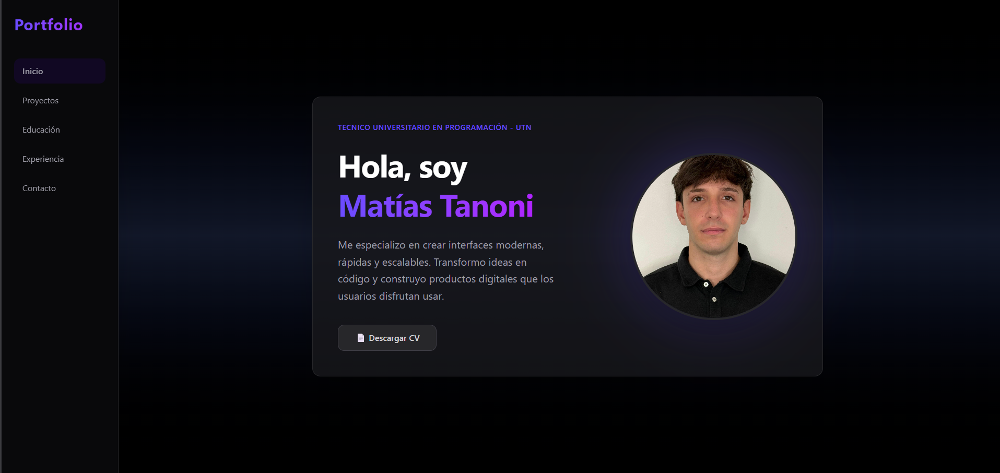
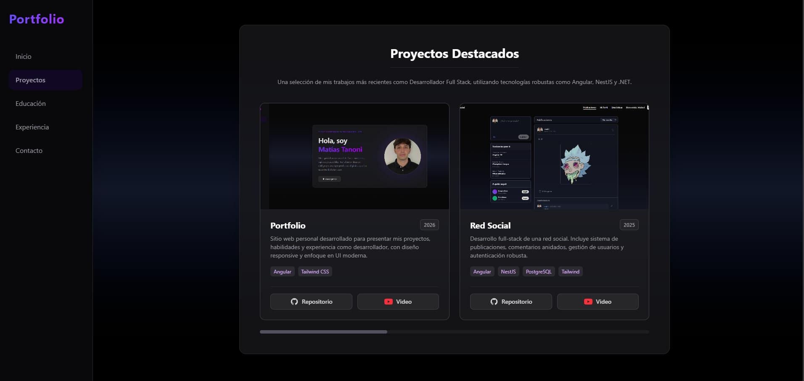
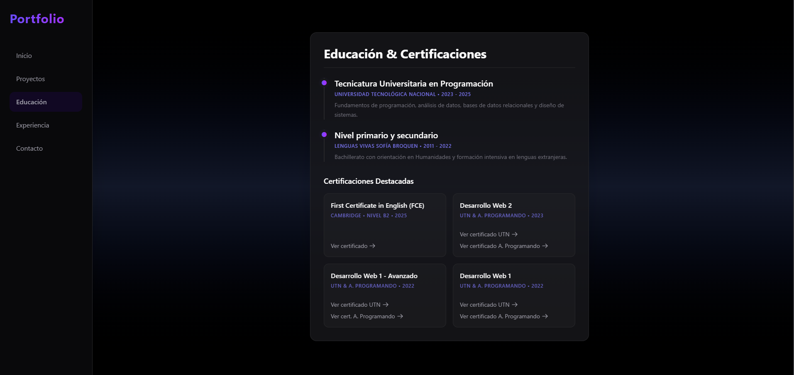
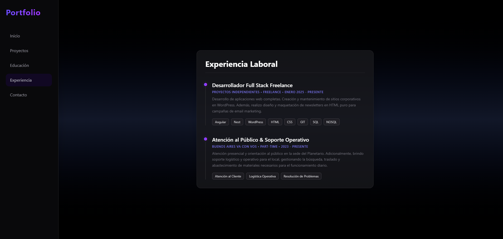
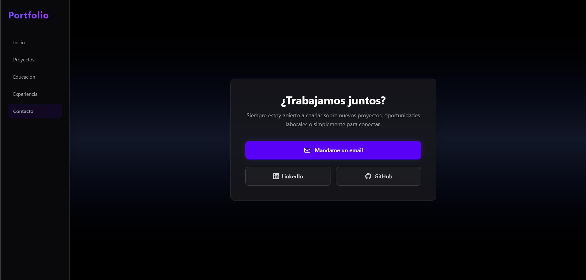

# Portfolio Personal | Matías Tanoni 🚀

Bienvenido al repositorio de mi portfolio personal.

## 🔗 Enlaces

- **Video Demostración:** [Ver en YouTube](https://www.youtube.com/watch?v=Hvv_DqMxtO0)
- **Portfolio en Vivo:** [Visitar sitio web](https://portfolio-dr8t.onrender.com/)
- **GitHub:** [Mi Perfil](https://github.com/MatiasTanoni)

## 🛠️ Tecnologías Utilizadas

Este proyecto fue construido utilizando tecnologías modernas para asegurar un rendimiento óptimo y un diseño completamente responsivo:

- **Framework:** 
- **Estilos:** 
- **Lenguajes:** 
  
  

## 📸 Secciones del Portfolio

Aquí puedes ver un recorrido visual por las distintas secciones de la aplicación:

### Inicio / Hero
*Presentación principal donde destaco mi perfil como desarrollador Full Stack freelance.*

### Proyectos
*Galería interactiva con mis trabajos más recientes y proyectos destacados en desarrollo web.*

### Educación
*Detalle de mi formación académica, incluyendo mis estudios de programación en la UTN.*

### Experiencia
*Recorrido por mi trayectoria y experiencia en la creación de soluciones tecnológicas.*

### Contacto
*Formulario funcional e información adicional para facilitar la comunicación.*

